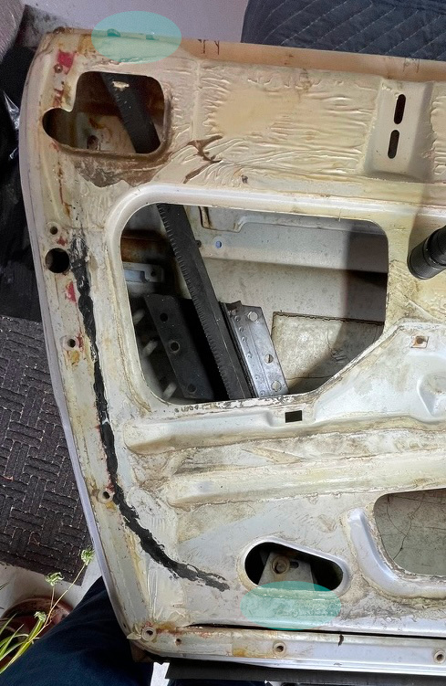
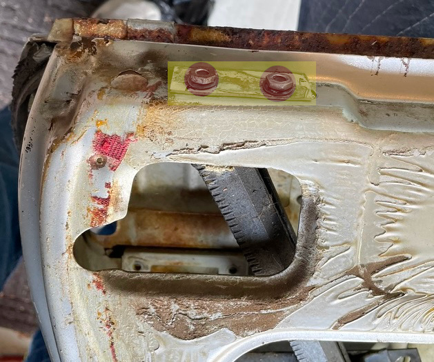
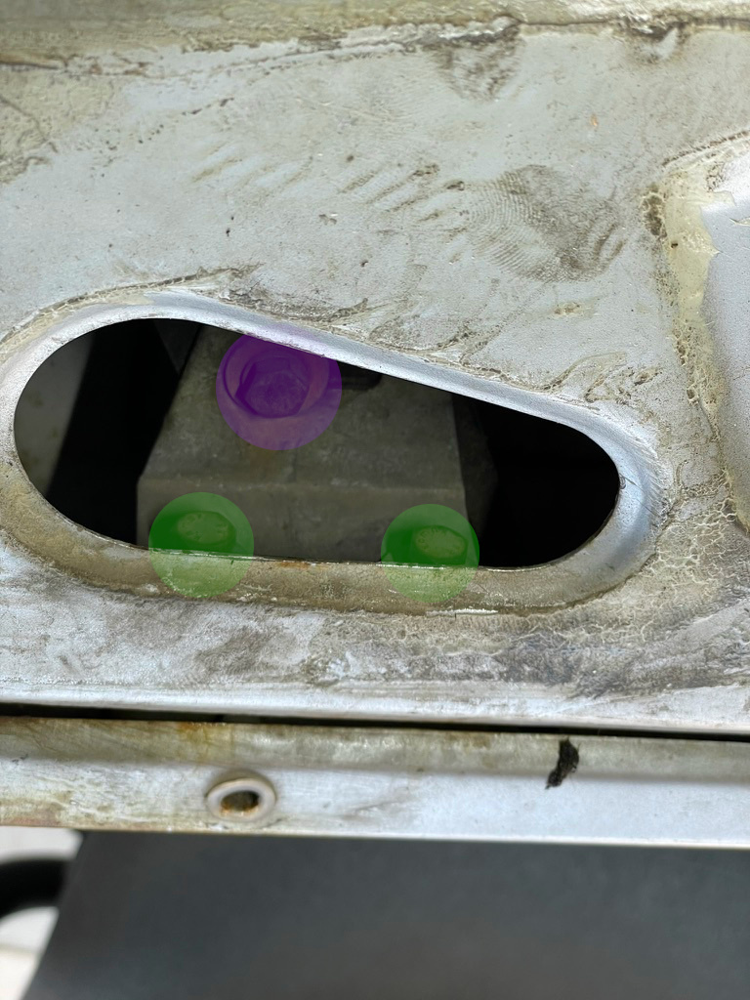
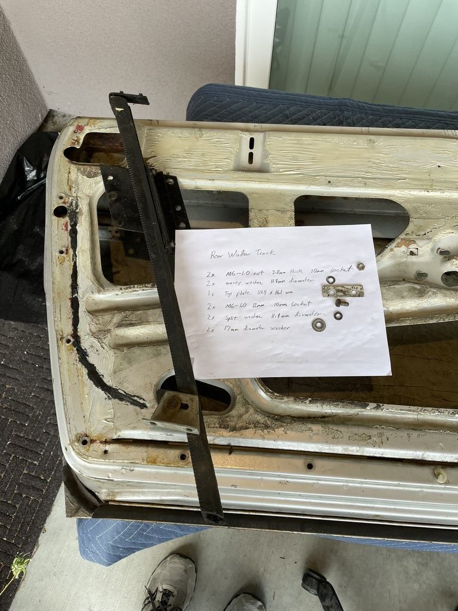

## Bolt Information
The general bolt locations are displayed in cyan.  The specific bolts are specified by the color in the table. The size column can be bolt size or diameter.  Sizes are in mm.
### Back window slider
|ID|Quantity|Size|Length|Socket|Other|
|--|--------|----|------|------|-----|
|${\color{lightgreen}\ A1\ }$|x2|M6-1.0|12|10||
|${\color{lightgreen}\ A2\ }$|x2|17|||Washer|
|${\color{lightgreen}\ A3\ }$|x2|11.1|||Split Washer|
|${\color{red}\ B1\ }$|x2|M6-1.0|||Nut 2.8 thick|
|${\color{red}\ B2\ }$|x2|11.8|||Wavey Washer|
|${\color{yellow}\ C1\ }$|x1||||Top Plate 54.4 x 16.1|
|${\color{purple}\ D1\ }$|x1||||Bolt on mounting bracket|

General mounting locations  
  

Top mounting locations  
  

Bottom mounting locations  
  

Hardware picture 
  

[Back](../DoorHardware.md)