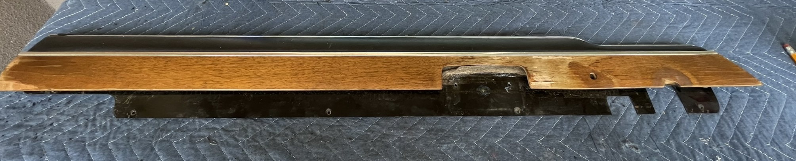
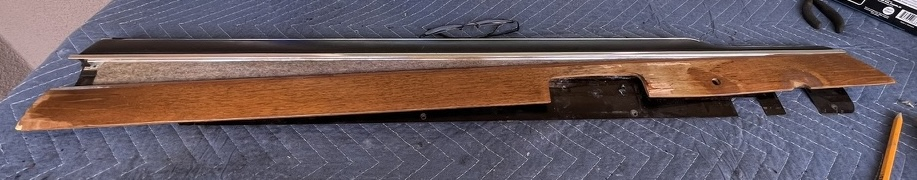
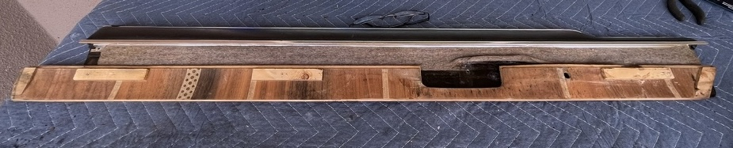
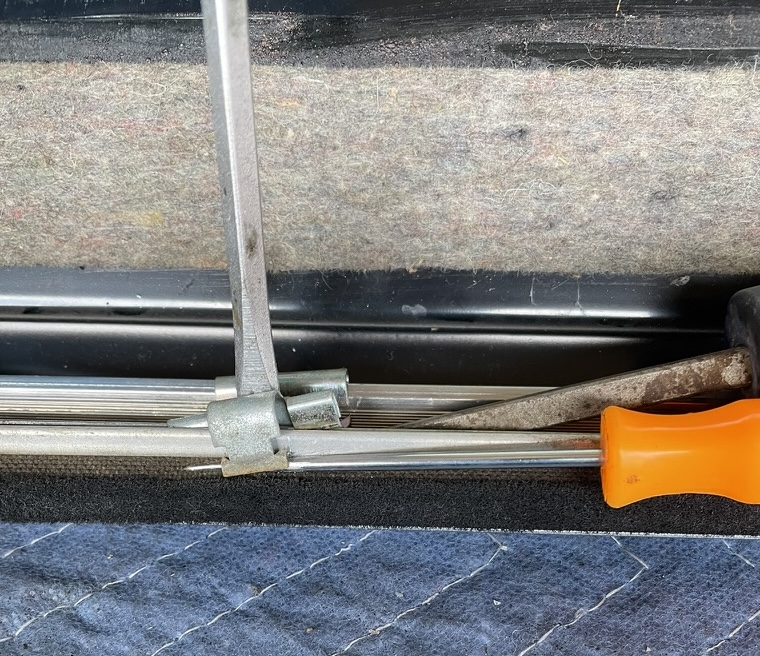

## Top inside trim
This is the trim piece.  My wood is in need of repair.  
  

Back side of trim showing 3 screws under felt to remove wood.  
  
  

The wood is slid out from under the trim.  
  

The back side showing the where the 3 screws were attached.  
  

The inner felt piece can be removed by taking off the 4 clips.  
  
To remove the clip the front was pulled up by the pick, then the back was pulled up by the vertical screw driver, and then a second screw driver pushed the clip up and off the trim.  
    
  
The part number for the inner felt strip or door brush is 51216754239 (Brush) Not available!  

[Back](../DoorHardware.md)