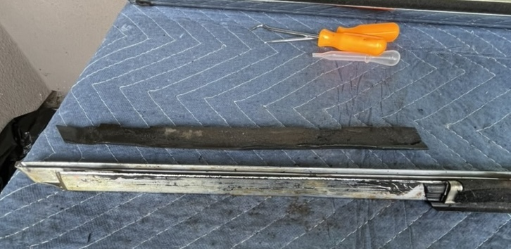
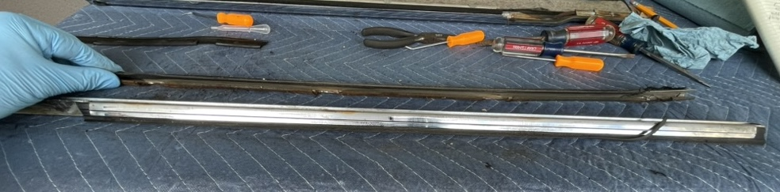
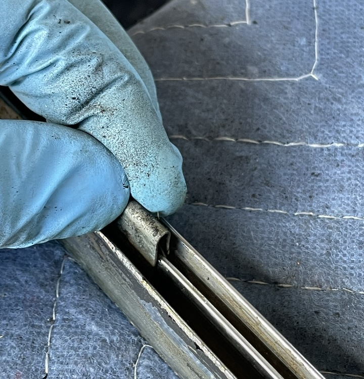
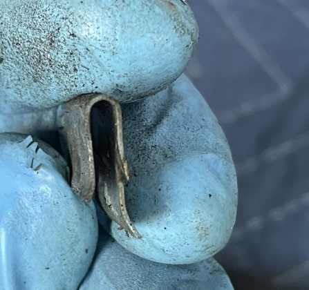

## Top outside trim
This is the trim in question.  It is being removed in the picture.  
 

The first item removed is the outer rubber that sits under the trim.  This is part number 54129734126 (Synthetic strip)  $4.03 per meter  
 

On the inside of the trim where the triangle window sits there is a small 285mm strip of rubber.  The part number 51216754323 or 51216754324 (Sealing)  This is no longer made by manufacturer.  
 

On the inside there is a U shaped piece that has the window felt attached.  Part number 51211813196 (Brush)  No longer made.  Underneath this there is the back side rubber that connects with the the previous triangle window rubber from above.  This is part 51211813195 (Rubber Seal)  $14.23  
  

The U channel with felt can be removed with a screw driver.  Simply pull it up.  
    
    

The rubber seal is difficult to remove.  I filed down an inexpensive pick from Harbor Freight so it would fit and slowly walked it out.  
  

Here are all the inner seals removed  
  

The last thing about the outer trim is that there are 6 clips holding the trim onto the car.  Mine were mostly rusted to the car.  Here is one clip that remained with the trim.  Part 51211803685 (Clamp)  $1.99 X 5  
  
  

[Back](../DoorHardware.md)