

# 12/29/2023 Driver Door Details
This page will try to document all the bolts and fasteners used for the door.  

## Door seals  
There are only 2 seals attached directly on the door.  The bottom and the back.  This is the bottom seal.  Part 51216740185 (Gasket) 
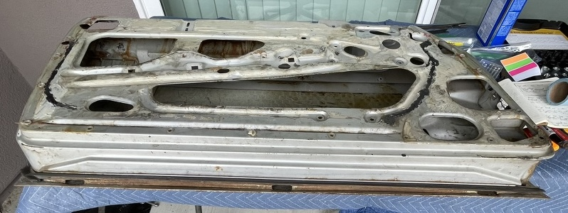  
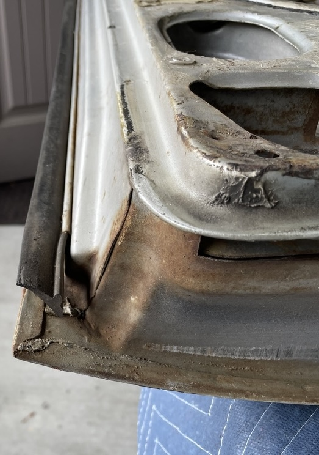  

This is the back seal.  Part 51216740180 & 51216740181 (Gasket) $113.13
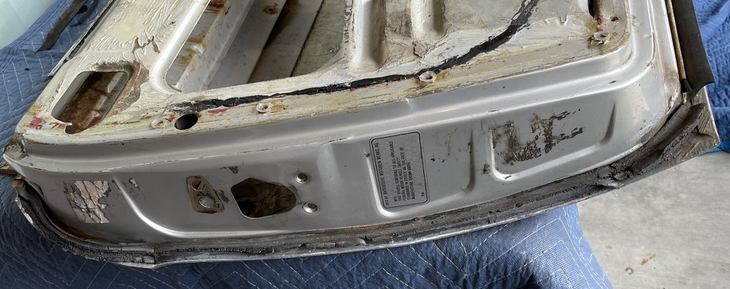  

## Top outside trim
This is the trim in question.  It is being removed in the picture.  
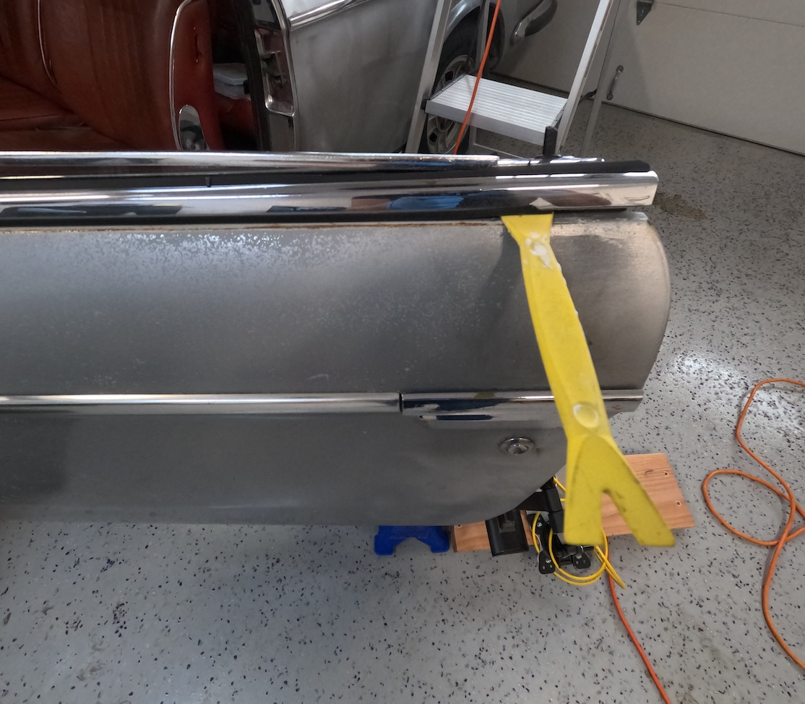 

The first item removed is the outer rubber that sits under the trim.  This is part number 54129734126 (Synthetic strip)  $4.03 per meter  
 

On the inside of the trim where the triangle window sits there is a small 285mm strip of rubber.  The part number 51216754323 or 51216754324 (Sealing)  This is no longer made by manufacturer.  
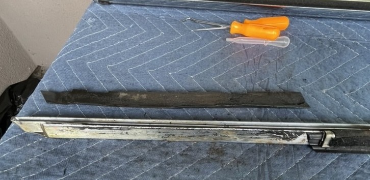 

On the inside there is a U shaped piece that has the window felt attached.  Part number 51211813196 (Brush)  No longer made.  Underneath this there is the back side rubber that connects with the the previous triangle window rubber from above.  This is part 51211813195 (Rubber Seal)  $14.23  
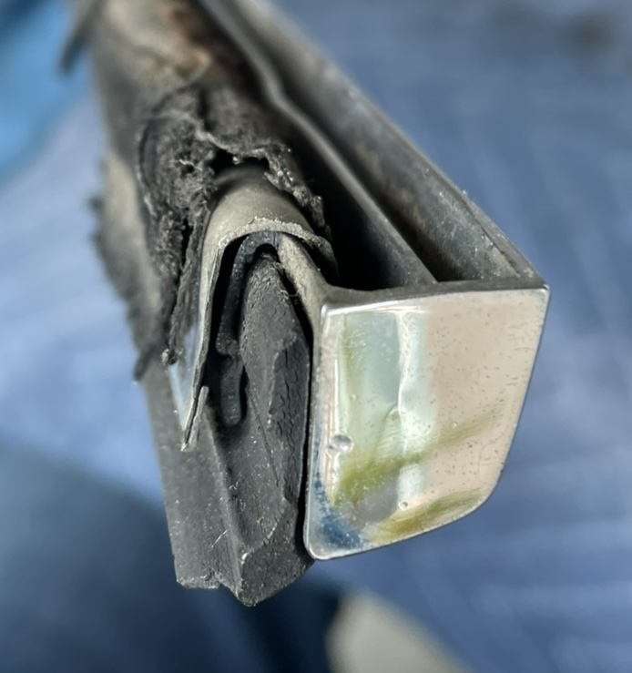  

The U channel with felt can be removed with a screw driver.  Simply pull it up.  
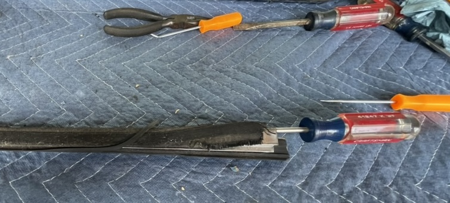    
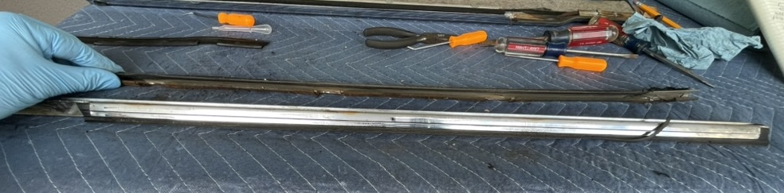    

The rubber seal is difficult to remove.  I filed down an inexpensive pick from Harbor Freight so it would fit and slowly walked it out.  
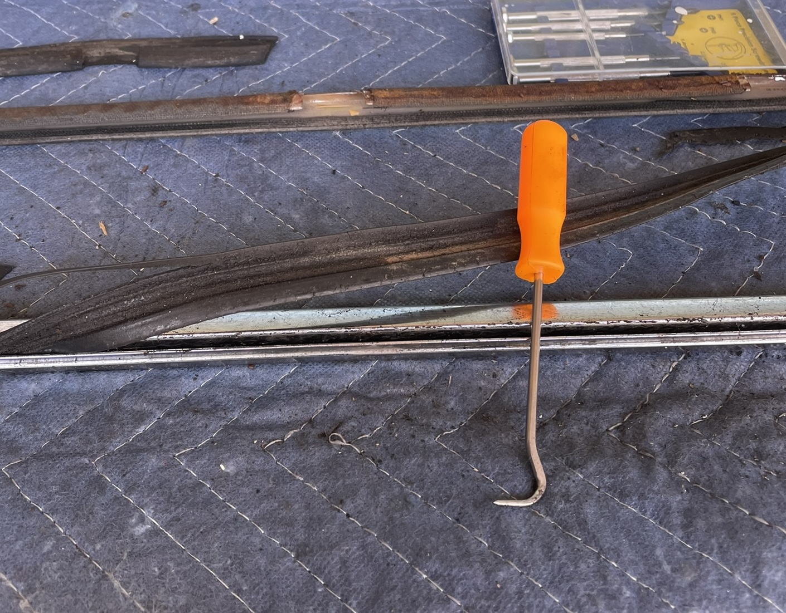  

Here are all the inner seals removed  
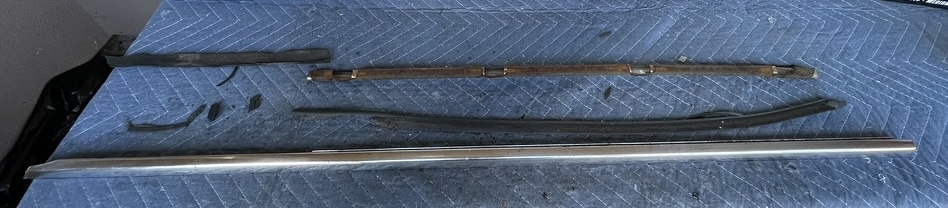  

The last thing about the outer trim is that there are 6 clips holding the trim onto the car.  Mine were mostly rusted to the car.  Here is one clip that remained with the trim.  Part 51211803685 (Clamp)  $1.99 X 5  
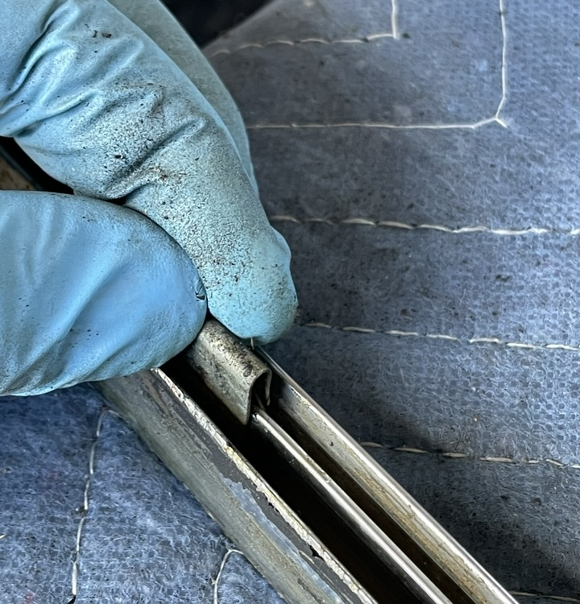  
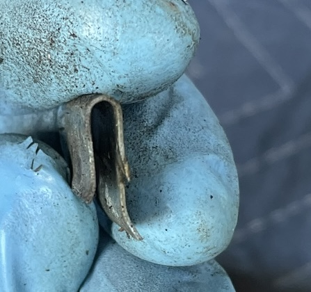  

## Top inside trim
This is the trim piece.  My wood is in need of repair.  
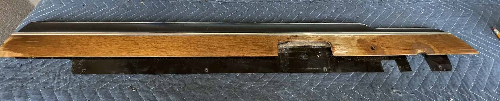  

Back side of trim showing 3 screws under felt to remove wood.  
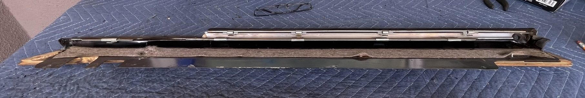    
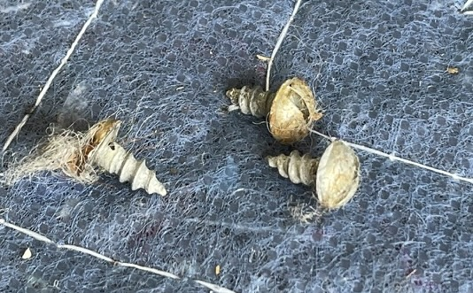 

The wood is slid out from under the trim.
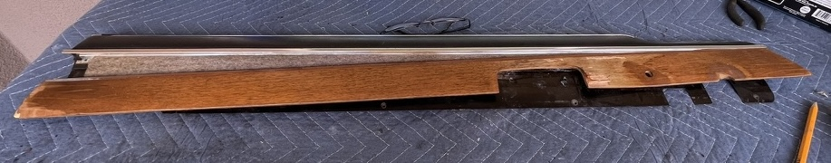  

The back side showing the where the 3 screws were attached.
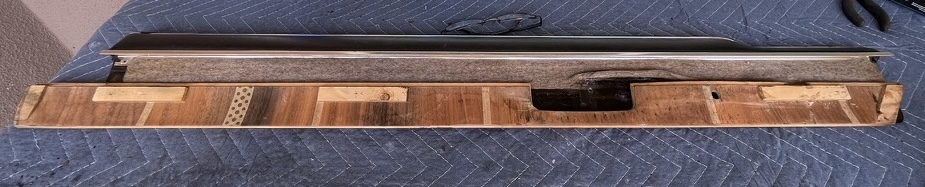  

The inner felt piece can be removed by taking off the 4 clips.  
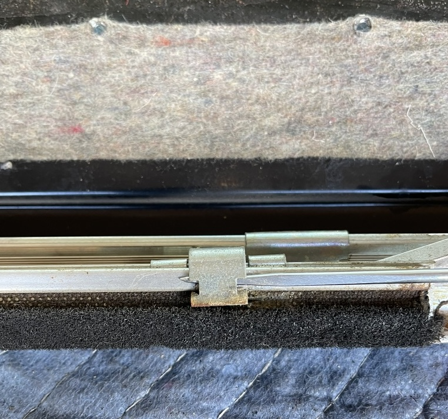 
To remove the clip the front was pulled up by the pick, then the back was pulled up by the vertical screw driver, and then a second screw driver pushed the clip up and off the trim.  
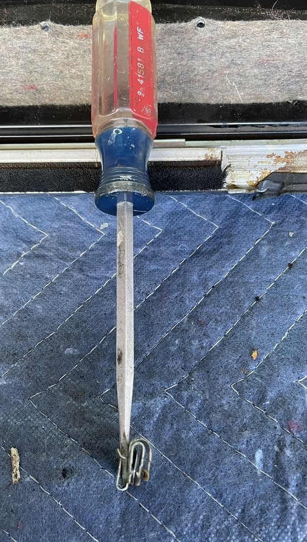 
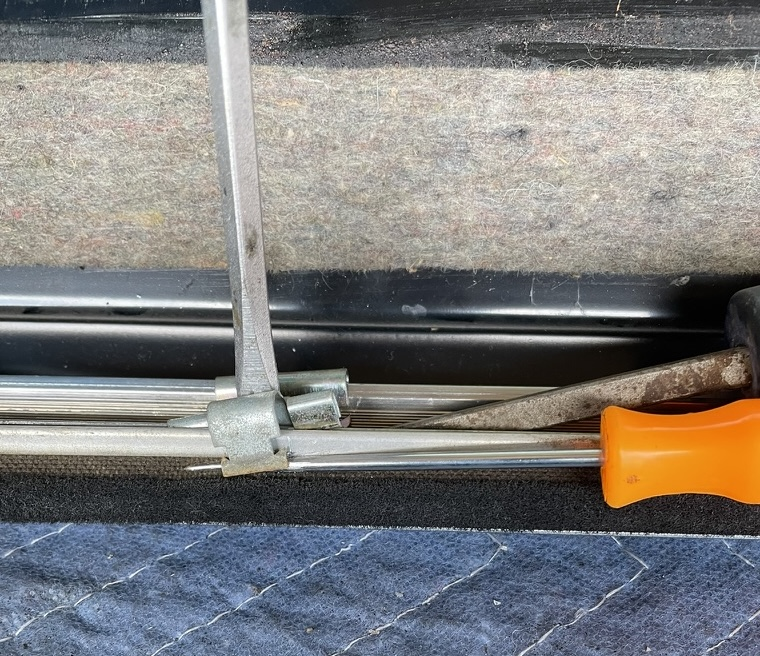 
The part number for the inner felt strip or door brush is 51216754239 (Brush) Not available!  

## Bolt Information
### Back window slider
|ID|Quantity|Size|Length|Socket|
|--|--------|----|------|------|
|<R>A</R>|x2|M8-1.25|25|13|

[Back](../readme.md)
