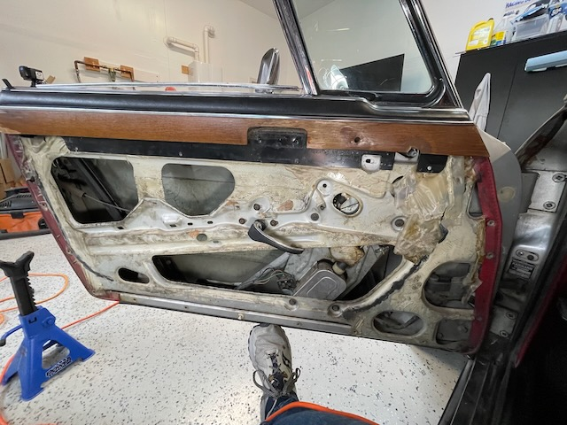
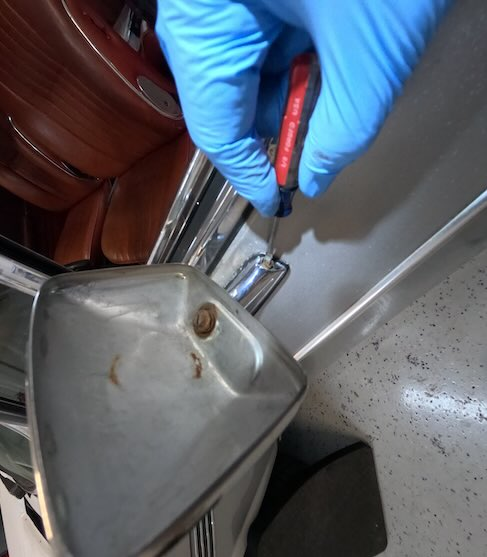
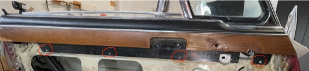
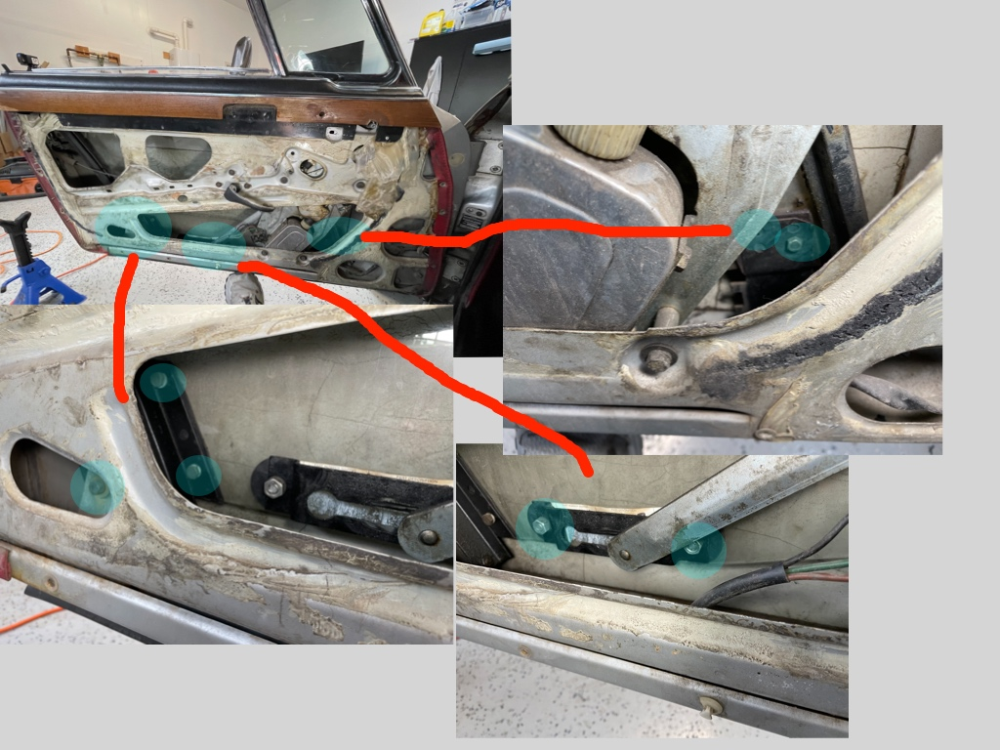
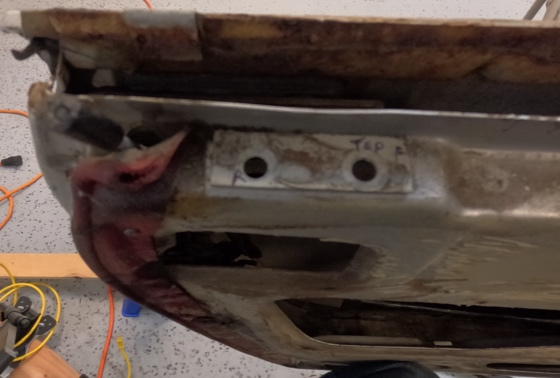
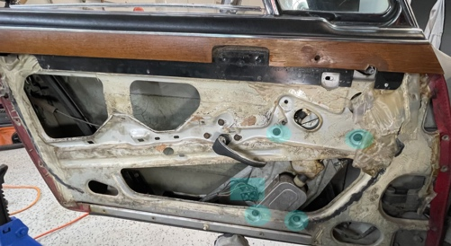
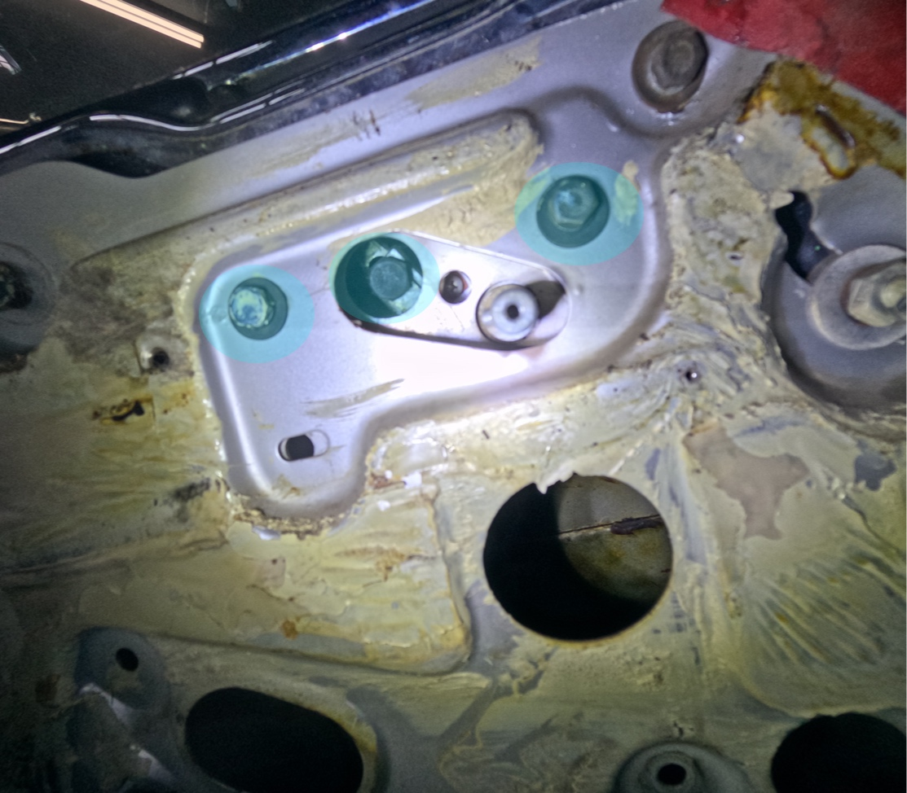
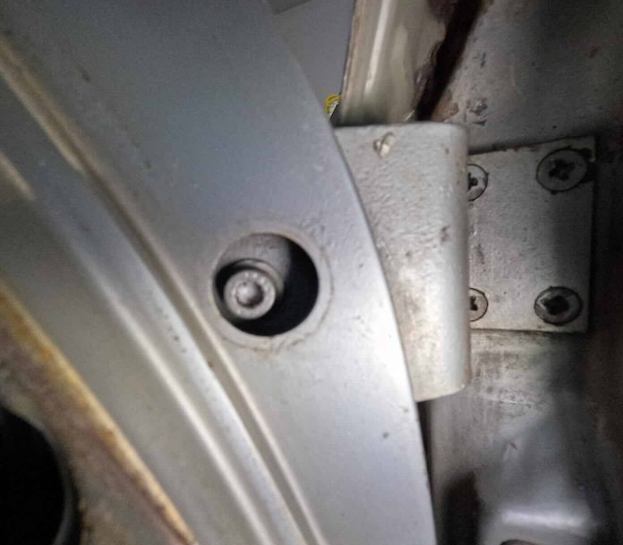
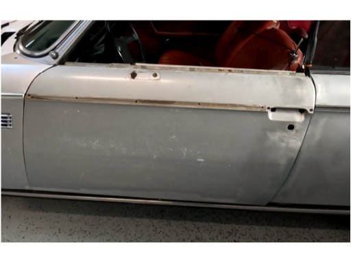

# 12/17/2023 Driver Door Dismantling
The door card was previously removed to unstick the power window motor.  The first image is the starting point for the door tear down.

  

Remove the outer top trim.  Slowly pry this up.  
  

Remove the mirror.  The screw is under the rubber and very rusted and stuck.  
  

Remove interior wood trim.  Remove screws and push up.  May need to pull out a bit because it may be slightly glued to the water barrier.  
  

Remove the glass.  Take out the 7 bolts/nut.  The small nut on the right had a screw that turned.  It probably should have a nut welded on back.  There also should be 2 in the front but mine only had the 1.  The window can then be lifted out the top.
  

The left track can be removed with the 2 top screws and the two on the bottom.  There is no bottom picture.  The top shows the holes relative to the door.  
  

The regulator and power drive can be removed by 4 bolts and 3 screws to remove the wires.  
  

The rotator assembly for the tiny front window can be removed.  There are 2 bolts holding it to the door and the middle bolt attaches it to the window for rotating.  Mine did not pull off the window easily.  I looked like maybe the metal was rough.  It appears it should pull straight down after the 3 bolts are removed.    
  

I don't have pictures for the tiny window removal.  I believe there where 3 screws on top and 1 in the bottom.  

## Door handle removal  
The screw behind the plastic on the interior handle is removed and the handle then pulls off.  
The 3 bolts around the handle are removed and the interior portion can be removed.  
The 2 phillips head screws can be removed from the outside handle from underneath.  
There are 4 nuts that are holding in the handle.  Remove these and the handle mechanism can be removed.  
Undo the large nut holding in the lock mechanism.  Once removed the lock should pull out.
There are 4 large phillips screws on the outside latch.  These should be remove.  There is one bolt still holding onto the latch from the inside of the door and its counter sunk so its hard to see.  Remove this and the latch should come out.  
## More trim  
The edge trim is removed by the nuts inside the door.  The very front nut is on the outside and it was 9mm while all the others were 10mm.  
## Hinges  
The hinge is attached to the door with 6 screws.  Five of the screws are standard bolts but 1 is special.  The one under the plastic cap.

This is a screw head for which I don't have a wrench.  I also don't know yet what kind of tool is needed.  Looks like some kind of torx.  
  

After removing everything but the 1 hinge screw I am now left with an empty door.  Once the last screw is out the door can be removed.
  