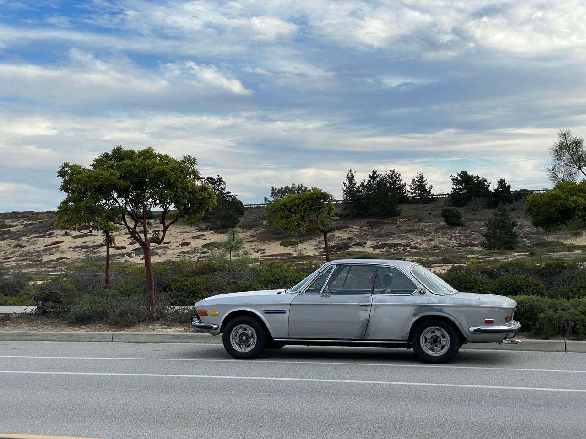

# 11/26/2023 Its Alive, First drive.
The carbs needed replacement because they were warped and binding causing the engine to run at 4000 rpm.  The brakes failed the day after delivery.  For safety the entire brake system was replaced.  All coolant hoses were replaced and an oil change was done.  Remaining issues for basic driving are, fix smooshy brakes, carb tuning, and engine timing.

  
[Back](../readme.md)